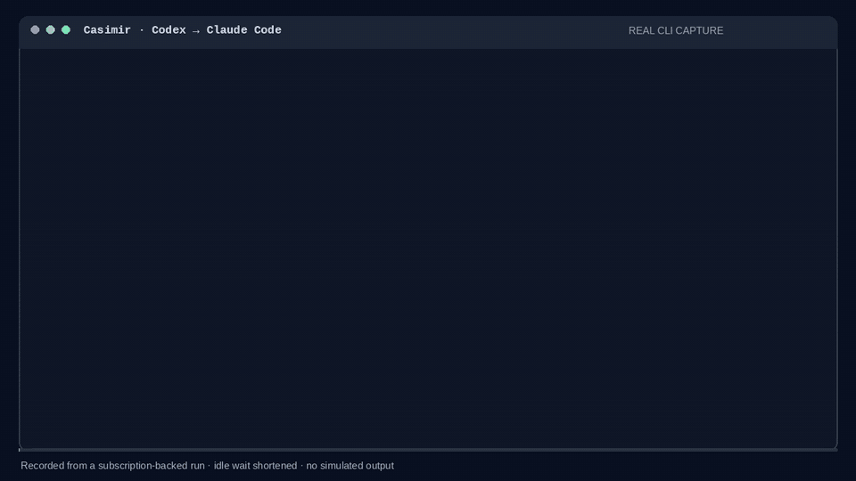

# Casimir

Replay, rerun and compare the sessions your coding agents already recorded.

Claude Code, Codex, Copilot CLI and Gemini CLI all keep a transcript of every session on disk.
Casimir reads those transcripts and lets you do three things with them:

- **Look back.** List, read and play back old sessions as clean transcripts.
- **Try again.** Send the same user prompts to a different model or a different agent, in a
  fresh Git worktree so your checkout is never touched.
- **Compare.** Put two runs side by side: files changed, tools used, tokens, cost, time, the
  final diff and, if you want, a verdict from an LLM judge.

A typical question it answers: *"I did this task with Claude Code last week. Would Codex (or a
cheaper model) have got there too, and what would it have cost?"*

[](docs/media/casimir-demo.mp4)

<sub>A real run: a saved Codex pagination task replayed through Claude Code on a subscription
login. Casimir makes a fresh worktree, runs the task, then runs a frozen check that passes. The
idle wait is trimmed; everything else is the actual terminal output.
[MP4](docs/media/casimir-demo.mp4) · [asciinema cast](docs/media/casimir-demo.cast)</sub>

## Project status

Casimir is at **1.0.0-rc.1**. It works and is tested on Linux, macOS and Windows in CI, but
the 1.0 release still needs live testing on macOS and Windows, human review of the judge, and
a few outside pilot users. The [release ledger](docs/production-readiness.md) tracks exactly
what's left.

| Agent | Support |
|---|---|
| Claude Code | Supported |
| OpenAI Codex | Supported |
| GitHub Copilot CLI | Experimental |
| Gemini CLI | Experimental |

Copilot and Gemini don't document their log formats, so those adapters may break when the
CLIs change, and they haven't been tested against live logins yet.

## Installation

You need Rust 1.85 or newer, a C linker, and Git.

```sh
git clone https://github.com/mikigraf/Casimir
cd Casimir
cargo install --path . --locked
```

That puts `casimir` on your `PATH`. If you'd rather not install it, `cargo build --release`
leaves the binary at `target/release/casimir`.

To rerun sessions you also need the agent CLI you're targeting (`claude`, `codex`, `copilot`
or `gemini`), signed in. Check your setup with:

```sh
casimir doctor
```

`doctor` reports versions, login status and storage without making any model calls.
Prebuilt release archives are described in [docs/distribution.md](docs/distribution.md).

## Quick start

```sh
# What sessions do I have?
casimir list

# What happened in my last Claude Code session?
casimir show claude:last

# Watch it back at 10x speed
casimir play claude:last --speed 10

# Rerun it with a different model in a throwaway worktree, then compare
casimir rerun claude:last --model sonnet

# Hand the same task to Codex instead
casimir rerun claude:last --harness codex
```

Every rerun ends with a comparison table and writes its artifacts to `~/.casimir/runs/`. Add
`--dry-run` to see the plan without running anything.

## Usage

### Picking a session

Anywhere a command takes `<session>`, you can pass:

- `last`, or `claude:last`, `codex:last`, `copilot:last`, `gemini:last`
- a session id, or any unique prefix of one
- a path to a log file, a Copilot session directory, or a Casimir run directory

### Browsing sessions

```
casimir list    [--harness claude-code|codex|copilot|gemini] [--cwd DIR] [--json]
casimir show    <session> [--thinking] [--full] [--sidechains] [--turn N] [--format text|md|json]
casimir play    <session> [--speed 5] [--max-delay 2000]
casimir stats   <session>
casimir export  <session> -o out.md|out.json [--share]
```

`--share` produces a redacted export that's safer to pass around. Read it before you send it
anywhere; see [docs/privacy.md](docs/privacy.md).

### Running experiments

```
casimir rerun     <session> [--harness H] [--model M] [--user verbatim|simulate] [--judge] ...
casimir fork      <session> --at-turn N [--message "..."] [rerun options]
casimir attribute <session> --turns-at 2,3,4 [rerun options]
casimir compare   <a> <b> [--judge] [--format text|md|json]
```

- **`rerun`** replays the session's user turns against another model or agent.
- **`fork`** restores the session as it was at turn N and continues from there, optionally with a
  different message. It needs a checkpoint that Casimir recorded during an earlier run.
- **`attribute`** resamples a failed session at several turns to find where it went wrong.
- **`compare`** diffs any two sessions or runs.

Some `rerun` options worth knowing:

| Option | What it does |
|---|---|
| `--user simulate` | Later user turns are rewritten by an LLM to fit what the new agent actually did |
| `--judge` | An LLM scores both sides, once in each order to cancel out position bias |
| `--replicates N` | Run the whole thing N times, since a single agent run is noisy |
| `--control` | Also rerun the original agent and model, to see how much runs vary on their own |
| `--checks FILE` | Run your own commands (tests, a script) against the result as a pass/fail check |
| `--workspace` | `auto` (default: fresh worktree), `same` (run in place) or a path to another repo |
| `--turns N` | Only replay the first N user turns |
| `--dry-run` | Print the plan and stop |

Run `casimir rerun --help` for the full list. Anything after `--` goes straight to the agent
CLI.

A checks file looks like this:

```json
{
  "schemaVersion": 1,
  "checks": [
    { "executable": "cargo", "args": ["test"], "timeoutSecs": 300, "expectedExitStatus": 0 }
  ]
}
```

### Housekeeping

```
casimir doctor [--json]                          check setup; no model calls
casimir runs                                     list past runs
casimir resume <run-dir> [--retry-interrupted]   pick up an interrupted run
casimir cleanup <run-dir> [--apply] [--checkpoints]
```

`cleanup` only shows what it would delete until you add `--apply`.

### Research tools

These exist for people evaluating agents or checking the judge and simulator themselves:

```
casimir brief <session> [-o brief.json]   draft a task rubric for a human to review
casimir pairs <run-dir>... -o DIR         blind real-vs-simulated user messages for spot checks
casimir pairs-score <key.json> <answers.json>
casimir predict-evaluation --corpus F -o DIR
casimir calibrate --corpus F --predictions F --reviewer-a F --reviewer-b F --adjudication F
```

### More examples

```sh
# Same task through Codex, with a simulated user and a judge
casimir rerun claude:last --harness codex --model gpt-5-codex --user simulate --judge

# Is Sonnet really different, or is it just noise? Add a control group.
casimir rerun claude:last --model sonnet --control --replicates 3

# What if I'd said something else at turn 3?
casimir fork claude:last --at-turn 3 --message "Use the existing helper instead of adding a new one"

# Which turn doomed this session?
casimir attribute claude:last --turns-at 2,3,4 --judge

# Three replicates each with two different simulator models
casimir rerun claude:last --model sonnet --user simulate --judge --replicates 3 \
    --sim-model claude-opus-5 --sim-model claude-sonnet-5

# Replay a Gemini CLI session through Copilot CLI
casimir rerun gemini:last --harness copilot

# Compare any two sessions or runs
casimir compare codex:last ~/.casimir/runs/2026-09-22_11-40-03-claude-code-sonnet-58fd0bfc --format md
```

## How a rerun works

1. Casimir parses the original session and pulls out what the user actually typed. Anything
   the agent injected on its own (system reminders, AGENTS.md contents, environment blocks,
   slash command echoes) is left out, so the target agent can add its own.
2. It creates a detached Git worktree under `~/.casimir/worktrees/` at the commit the original
   session started from. Your checkout is left alone.
3. It sends the first prompt to the target agent in headless mode and streams the output. Later
   prompts are sent as-is, or rewritten by the simulator with `--user simulate`. The agent's
   own session is resumed between turns, so it keeps its context just like it would
   interactively.
4. When the agent finishes, Casimir reads the agent's own log of the new session, captures the
   workspace diff, runs any checks, and writes a report.

Each run gets its own directory:

```
~/.casimir/runs/<timestamp>-<harness>-<model>-<original-id>/
  original.json    the original session, normalized
  session.json     the rerun, normalized
  raw.jsonl        raw output from the agent
  diff.patch       what the rerun changed
  original.patch   what the original session changed, when Casimir can work it out
  record.jsonl     every model reply and tool call, for auditing
  report.md        the comparison
```

With `--replicates` there's one subdirectory per replicate plus a summary.

The report keeps separate verdicts for whether the agent ran to completion, whether your
checks passed, what the judge thought, and the overall outcome. A run that finishes cleanly
but has no checks or judge is reported as *inconclusive*. A failed required check always
means a failed run.

For the reasoning behind all of this (how diffs are scored, how the judge is kept honest,
what the simulator is allowed to do) see [docs/methodology.md](docs/methodology.md).

## Where the logs come from

| Agent | Location | Override |
|---|---|---|
| Claude Code | `~/.claude/projects/<cwd-slug>/<session-id>.jsonl` | `CLAUDE_CONFIG_DIR` |
| Codex | `~/.codex/sessions/YYYY/MM/DD/rollout-<ts>-<id>.jsonl` | `CODEX_HOME` |
| Copilot CLI | `~/.copilot/session-state/<session-id>/` | `COPILOT_HOME` |
| Gemini CLI | `~/.gemini/tmp/<project>/chats/session-<ts>-<id>.jsonl` | `GEMINI_CLI_HOME` |

Casimir never edits existing logs. When you fork a session, it writes a new conversation file
alongside them so the agent can resume from it.

## Configuration

### Judge and simulator models

The judge and the user simulator are LLM calls. By default (`--llm auto`) Casimir uses your
signed-in Claude Code subscription, falling back to a signed-in Codex subscription. It will not
quietly switch to an API key just because one is set in your shell, and it strips API keys from
the agent subprocesses for the same reason.

```sh
claude auth login     # or: codex login  (codex login --device-auth on headless machines)
casimir doctor --json # look for "subscriptionReady": true
```

Other backends:

- `--llm api` calls the Anthropic API directly with your API key.
- `--llm cmd` pipes the prompt into `$CASIMIR_LLM_CMD`, with the system prompt in
  `$CASIMIR_LLM_SYSTEM`.

`--judge-model`/`--judge-llm` and `--sim-model`/`--sim-llm` configure the two roles
separately. The cost Claude reports is its estimate of what the API would have charged, not
your subscription bill. Codex doesn't report a cost, so Casimir shows it as unknown.

### Permissions

Casimir keeps whatever permission settings your agent already uses. If you want to run an agent
with its safety checks turned off, you have to pass `--allow-unrestricted` as well as the
agent's own bypass flag, even when that flag comes after `--`.

A worktree keeps edits out of your checkout, but it is not a sandbox. The agent runs as you and
can reach anything you can. Codex has a native sandbox on Windows; Claude Code currently
doesn't.

### Timeouts

Agent turns time out after 15 minutes (`--turn-timeout`) and judge or simulator calls after 5
(`--llm-timeout`). If a run gets interrupted, `casimir resume <run-dir>` continues it. Casimir
won't resend a prompt that might already have run unless you pass `--retry-interrupted`.

### Environment variables

| Variable | Purpose |
|---|---|
| `CASIMIR_HOME` | Where runs, worktrees and checkpoints go (default `~/.casimir`) |
| `CASIMIR_CLAUDE_BIN`, `CASIMIR_CODEX_BIN`, `CASIMIR_COPILOT_BIN`, `CASIMIR_GEMINI_BIN` | Use a different agent executable |
| `CASIMIR_LLM_CMD`, `CASIMIR_LLM_SYSTEM` | Custom judge/simulator command for `--llm cmd` |
| `CASIMIR_DEBUG` | Print extra diagnostics, such as why an agent log couldn't be read |
| `CLAUDE_CONFIG_DIR`, `CODEX_HOME`, `COPILOT_HOME`, `GEMINI_CLI_HOME` | Where to look for agent logs |

## Limitations

- **Only the prompts are replayed.** Casimir recreates the repository, but not the network,
  external services, installed tools or anything else outside it.
- **Forking needs a Casimir checkpoint.** Older sessions you import can be read and fully
  rerun, but you can't fork them mid-session. Guessing the state from commit timestamps isn't
  reliable enough. See [docs/checkpoints.md](docs/checkpoints.md).
- **Subagents aren't replayed separately.** You can view Claude Code subagent traffic with
  `--sidechains`, but on a rerun the target agent spawns its own.
- **Experiments use up your quota.** Judging runs every comparison in both orders, so N
  replicates cost about 2 × N × `--judge-repeats` judge calls, plus a rubric draft and some
  simulator calls.
- **Small samples are small.** Three replicates give you a rough idea, not a precise number.
  Read the intervals in the report. There's no seed control or adaptive stopping.
- **Gemini reruns trust the worktree.** They set `GEMINI_CLI_TRUST_WORKSPACE=true` so headless
  mode will run there.
- **No standard trace export yet.** `session.json` and `record.jsonl` are the formats to use.

## Documentation

- [Methodology](docs/methodology.md): how scoring, judging, simulation and attribution work
- [Research notes](docs/research.md): the papers behind the design, and where Casimir differs
- [Checkpoints](docs/checkpoints.md): what gets saved for forks, and what doesn't
- [Privacy](docs/privacy.md): what's stored locally and how sharing exports are redacted
- [Troubleshooting](docs/troubleshooting.md)
- [Migrating from earlier versions](docs/migration.md)
- [Validation results](docs/validation.md): what has been tested against real providers
- [Release ledger](docs/production-readiness.md) and [distribution](docs/distribution.md)

## Contributing

Issues and pull requests are welcome. Before opening a PR, please run:

```sh
cargo fmt --check && cargo fmt --check --manifest-path tests/fixture/Cargo.toml
cargo clippy --all-targets -- -D warnings
cargo test
python3 -m unittest discover -s tests -p 'test_*.py'
```

The Rust tests use a compiled fake agent (`tests/fixture`), so they don't need any provider
logins. CI runs them on Linux, macOS and Windows with both stable Rust and 1.85.

There is also a live end-to-end check against a real Claude Code login. It uses up your
subscription quota and keeps its worktrees around so you can look at them:

```sh
python3 scripts/smoke-claude.py --output .context/live-check
```

Use a new output directory each time, or `--resume` to pick up where it stopped. A model can
fail the task and the check still pass, as long as Casimir reports that failure correctly. See
[docs/validation.md](docs/validation.md) for what it covers.

## Security

Please report vulnerabilities privately. See [SECURITY.md](SECURITY.md).

## License

[MIT](LICENSE)
